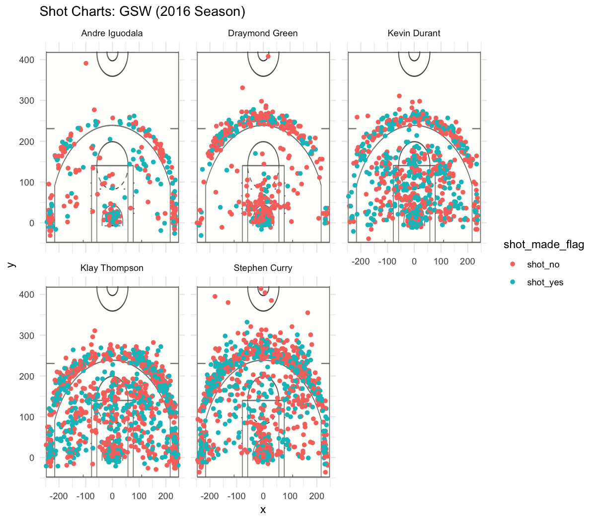

```{r setup, include=FALSE}
knitr::opts_chunk$set(echo = TRUE)
```

#Effective Shooting Percentage 
```{r, warning=FALSE, message=FALSE, echo=FALSE}
shots_data <- readr::read_csv("../data/shots-data.csv")
```

##2PT 
```{r 2PT, echo=FALSE, message=FALSE}
 
library(dplyr)
twopoint <- shots_data[shots_data$shot_type == "2PT Field Goal", c("name", "shot_made_flag")] %>% group_by(name) %>% summarise(total = n(), made = sum(shot_made_flag == "shot_yes")) %>% mutate(perc_made = made/total) %>% arrange(desc(perc_made))
twopoint
```
##3PT 
```{r 3PT, echo=FALSE}

threepoint <- shots_data[shots_data$shot_type == "3PT Field Goal", c("name", "shot_made_flag")] %>% group_by(name) %>% summarise(total = n(), made = sum(shot_made_flag == "shot_yes")) %>% mutate(perc_made = made/total) %>% arrange(desc(perc_made))
threepoint
```

##Overall
```{r overall, echo=FALSE}

overall <- shots_data[, c("name", "shot_made_flag")] %>% group_by(name) %>% summarise(total = n(), made = sum(shot_made_flag == "shot_yes")) %>% mutate(perc_made = made/total) %>% arrange(desc(perc_made))
overall
```
##PNG image of the facetted shot charts 
```{r label, out.width = "80%", include = TRUE, echo = FALSE, fig.align='center'}
library(knitr)

```

